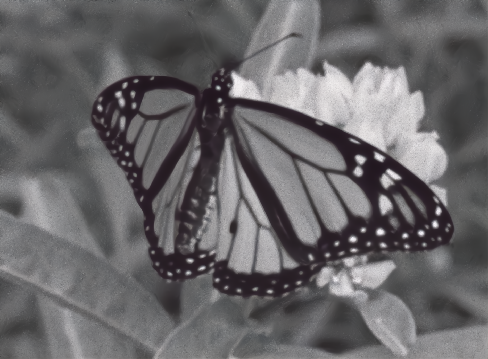
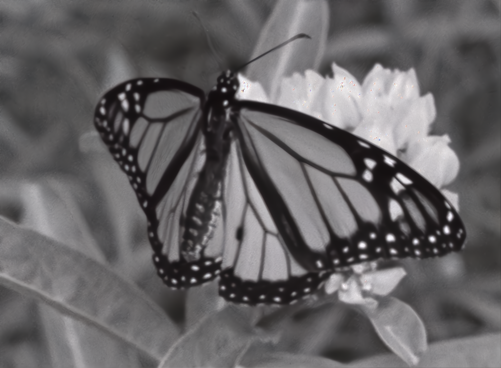

# Image Denoising and Deblurring Filters

This repository presents the following article in Colab:


## Installation
```
git@github.com:thuhangkhuat/image_filtering.git
```

## Run simulation
The current version supports four methods:
1. Inverse Filtering
2. Landweber Filtering
3. Wiener Filtering
4. NAFNet Model (Deep Learning)

To run three traditional filters:
1. Open Google Colab
2. Upload lab1.ipynb
3. Click Runtime → Run all to execute the simulations.

To run NAFNet model:
1. Open Google Colab
2. Upload NAFNet_demo_on_Image_Denoising.ipynb and run to denoise the image
3. Then, upload NAFNet_demo_on_Image_Debluring.ipynb and run to deblur the image


## Visualization

Below are visualizations of the NAFNet model:

|  |  |
|:---:|:---:|

<!-- ## Citation
```
@ARTICLE{10964594,
  author={Khuat, Thu Hang and Bui, Duy-Nam and Duong, Thuy Ngan and Phung, Manh Duong},
  journal={Robotics and Autonomous Systems}, 
  title={Polar Coordinate-based Differential Evolution for Moving Target Search Using Vision Sensor on Unmanned Aerial Vehicles}, 
  year={2025},
  volume={},
  number={},
  pages={},
  keywords={Optimal search, unmanned aerial vehicles, differential evolution},
  doi={}}
``` -->